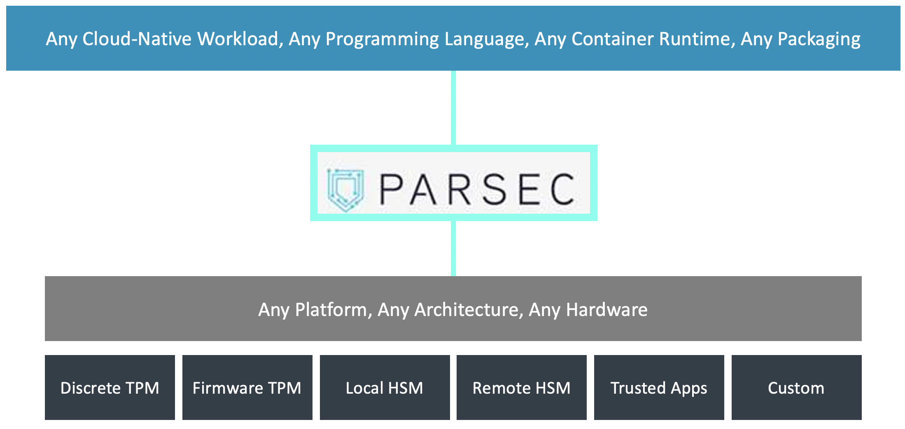

<!--
  -- Copyright 2019 Contributors to the Parsec project.
  -- SPDX-License-Identifier: Apache-2.0
--->

  
    
  
  
  
      

# Welcome To PARSEC

**PARSEC** is the **P**latform **A**bst**R**action for **SEC**urity, an open-source initiative
to provide a common API to hardware security and cryptographic services in a platform-agnostic way. This abstraction layer keeps workloads decoupled from physical platform details, enabling cloud-native delivery flows within the data center and at the edge.

  

Read the Parsec documentation [**online**](https://parallaxsecond.github.io/parsec-book/).

Read the whitepaper [**Security for the Infrastructure Edge**](https://www.arm.com/-/media/global/people/Security-For-The-Infrastructure-Edge-White-paper-NDA).

# Why PARSEC?

Use Parsec when you need:

- A **portable interface to your platform's Root of Trust** in order to manage keys and perform cryptographic operations without knowledge of the hardware.
- A simple and portable way to access the **best available security** of your platform in your **preferred programming language**.

# What PARSEC Provides

The value proposition of Parsec is that it provides the following:

- **Abstraction** – a common API that is truly agnostic and based on modern cryptographic principles
- **Mediation** – security as a microservice, brokering access to the hardware and providing isolated key stores in a multi-tenant environment
- **Ergonomics** – a client library ecosystem that brings the API to the fingertips of developers in any programming language: “easy to consume, hard to get wrong”
- **Openness** – an open-source project inviting contributions to enhance the ecosystem both within the service and among its client libraries

# Maintainers

PARSEC is a collaborative project. The current list of the individuals and organizations who maintain this project can be found [**here**](./MAINTAINERS.toml).

# Partner Organizations

See who is [**using and contributing to PARSEC**](./PARTNERS.md).

# Getting Started

If you are running on x86 Linux, check out [this guide](https://parallaxsecond.github.io/parsec-book/getting_started/linux_x86.html) to get started with Parsec quickly!

For examples of how to access PARSEC as a client application, check [this Rust client documentation](https://docs.rs/parsec-client/*/parsec_client/core/basic_client/struct.BasicClient.html).

Check the [**user**](https://parallaxsecond.github.io/parsec-book/parsec_users.html), [**client developer**](https://parallaxsecond.github.io/parsec-book/parsec_client/index.html) and [**service developer**](https://parallaxsecond.github.io/parsec-book/parsec_service/index.html) guides for more information on building, installing, testing and using Parsec!

# Community

Come and ask questions or talk with the Parsec Community in our Slack channel or biweekly meetings.
See the [Community](https://github.com/parallaxsecond/community) repository for more information on how to join.

# Contributing

We would be happy for you to contribute to Parsec!
Please check the [**Contribution Guidelines**](https://parallaxsecond.github.io/parsec-book/contributing/index.html)
to know more about the contribution process.
Check the [**open issues**](https://github.com/orgs/parallaxsecond/projects/1) on the board if you
need any ideas 🙂!

# License

The software is provided under Apache-2.0. Contributions to this project are accepted under the same license.
