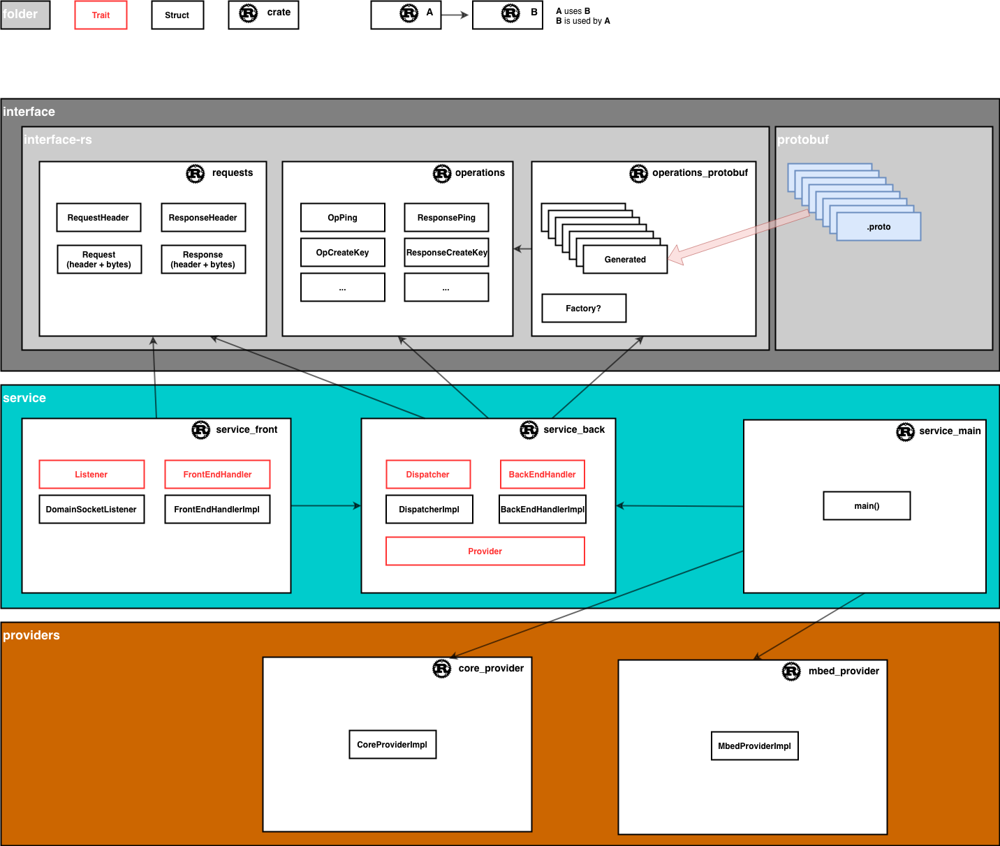

<!--
  -- Copyright (c) 2019, Arm Limited, All Rights Reserved
  -- SPDX-License-Identifier: Apache-2.0
  --
  -- Licensed under the Apache License, Version 2.0 (the "License"); you may
  -- not use this file except in compliance with the License.
  -- You may obtain a copy of the License at
  --
  -- http://www.apache.org/licenses/LICENSE-2.0
  --
  -- Unless required by applicable law or agreed to in writing, software
  -- distributed under the License is distributed on an "AS IS" BASIS, WITHOUT
  -- WARRANTIES OR CONDITIONS OF ANY KIND, either express or implied.
  -- See the License for the specific language governing permissions and
  -- limitations under the License.
--->
# **Source Code Structure**

## **Introduction**
This document presents the overall organisation of the source code repository, and provides pointers to key definitions and implementations.

## **Status**
This is preliminary documentation. It may be incomplete, and is subject to change without notice.

## **Audience**
An understanding of the source code repository structure is essential for developers who are contributing functionality to the service or any of its client libraries.

## **Overview**
This project is a client-server system. It is composed of a service, which exposes an API to clients that reside in separate processes on the same host. An IPC mechanism is defined to allow these external client processes to call the API in any programming language. This project maintains client libraries for a number of popular programming languages. The service itself is written in the [Rust](https://www.rust-lang.org) programming language. The API provides access to platform security facilities for key management and cryptography. Client applications call the API in order to access these facilities without needing to know about the underlying platform hardware. The service fulfills the operations by routing them to whatever platform facilities are available, such as a Hardware Security Module (HSM), Trusted Platform Module (TPM) or Trusted Application (TA).

The API is closely aligned with the [Platform Security Architecture (PSA) Crypto API](https://github.com/ARMmbed/mbed-crypto/blob/psa-crypto-api/docs/PSA_Cryptography_API_Specification.pdf). PSA Crypto is specifically a C interface. This project takes the operations of that C interface and wraps each of them in an IPC [wire protocol](/wire_protocol.md). There is intentionally a very close correpondence between the two APIs, and the contracts of the operations are identical in the majority of cases. However, the service also exposes a number of new operations that are designed to help clients consume it more easily.

The source code is organised into three main components: the [**service**](https://github.com/parallaxsecond/parsec), the [**client**](https://github.com/parallaxsecond/parsec-client-go) and the [**interface**](https://github.com/parallaxsecond/parsec-interface-rs). Each of these components is distributed as a GitHub repository. 

Other items are the **docs**, found in the service and which contains all of the documentation for the project (some of which you are reading now), the [**test**](https://github.com/parallaxsecond/parsec-client-test) repository, which contains integration tests for the end-to-end system, and the [**operations**](https://github.com/parallaxsecond/parsec-operations) repository which contains the language-agnostic contracts for communicating with the service.

The remainder of the document will examine the contents of these repositories.

## **The `service` Repository**
The `service` repository contains the code for the service. The service is written in [**Rust**](https://www.rust-lang.org). Rust projects are organised into modular units known as [**crates**](https://doc.rust-lang.org/beta/book/ch07-00-managing-growing-projects-with-packages-crates-and-modules.html), each of which is formed of one or more [**modules**](https://doc.rust-lang.org/beta/book/ch07-02-defining-modules-to-control-scope-and-privacy.html), which are built using the [**Cargo**](https://doc.rust-lang.org/beta/book/ch01-03-hello-cargo.html) build system. A Rust crate can be compiled into either a library or an executable. The service is composed of a series of modules - represented by folders - defining the major components of the system.

The `bin` directory defines the executable which links all the components together and runs the main loop of the service.

The `front` module houses the code for the front-end functionality of the service. The front-end is responsible for listening on the endpoint, such as a domain socket, and using the [wire protocol](/wire_protocol.md) to read and interpret API requests from clients. The front-end is also responsible for serializing responses according to the same wire protocol, in order to relay them back to the calling client.

The `back` module is responsible for routing client API requests to a back-end **provider**. A provider is a module that knows how to fulfill a request using available platform facilities such as HSM, TPM, TA or software. The service can be linked against one or more providers. The back-end module includes a registration mechanism that allows the providers to announce their presence in the overall system. There is also a dispatch mechanism that allows each incoming request to be routed to the appropriate provider. The provider is instructed to perform the operation, and the results are marshalled back to the front-end for onward serialization and return to the client.

The `authenticators` module contains the components that carry out the authentication of incoming requests. Depending on the `auth_type` specified in the request header, the appropriate authenticator is selected to parse and assess the `authentication` request field. The result is either an error or the identifier of the application sending the request. Authenticators may use the underlying security hardware to determine if the request has been correctly authenticated. For a more detailed description of authentication and application identity, see the [**API overview**](/api_overview.md).

The `key_id_managers` module offers functionality for the providers for persisting mappings between key names and provider-specific key IDs. The key ID managers close the gap between the API, which allows keys to be addressed by a UTF-8 name, and the providers which have specific requirements for key handles (e.g. Mbed Crypto uses a 32 bit value for handles of persistent keys). Using a key ID manager is only required for persistent keys and the only current implementation stores the mappings on disk.

Building the service will combine the frontend and backend components mentioned above into one executable. It also links additional Rust crates that contain the providers, as well as crates to support the IPC interface. On Linux systems, this binary runs as a daemon. While it is running, client applications (on the same host) can locate the endpoint and make API calls.

### **The `provider` Sub-Folder**
The `provider` folder contains the provider modules, which connect the service back-end with the hardware or software security facilities of supported target platforms.

Providers can be linked statically into the service. Where this is done, they must be written in Rust and modularised as crates. Existing providers that follow this pattern include the `core_provider` and the `mbed_provider`.

The `core_provider` module is a provider of operations that are implemented by the service itself, rather than by the platform's underlying security facilities. These core operations include operations for discovery, configuration and housekeeping of the service. They are not cryptographic or key management operations. (The "ping" operation is an example of one that is serviced by the core provider: it allows a client to determine whether the service itself is responding).

The `mbed_provider` module houses a provider based on [**MBed Crypto**](https://github.com/ARMmbed/mbed-crypto), which is the reference implementation of the PSA Crypto API Specification. The `mbed_provider` is a full provider in its own right, and allows for the full capabilities of the service to be provided in a software-only solution. But the `mbed_provider` also services as a branching point to connect with hardware or trusted applications through its own internal Harware Abstraction Layer (HAL). This provider only supports persistent key storage.

Like the `client` folder, the `provider` folder is also a key extension point for partner contributors. This project eagerly welcomes contributions of new providers in order to connect the service with the security facilities of host platforms and extend the ecosystem.

It is not necessary for providers to be written in Rust. A provider must be written in Rust in order to be statically linked into the core service and hence to reside within the same running process. But the architecture also supports providers running as separate processes. These providers can be written in any suitable programming language. This is an option to consider if you wish to contribute a new back-end provider, but you wish to use a programming language other than Rust.

## **The `interface` Repository**
The `interface` crate contains the Rust code that is needed to allow the service to conform to the interface and wire protocol. It is also used by the Rust client library, but it is not used by other client libraries (since those are written in other languages).

The crate contains three Rust modules: `requests`, `operations` and `operations_protobuf`.

The `requests` module defines model objects for request and response headers as described in the wire protocol specification. It also contains the Rust code needed to serialize and de-serialize these header structures (a process sometimes known as *marshalling*). This code is hand-written and verified according to the written specification. It is not auto-generated, and it is unrelated to the protobuf API contracts. The `requests` module functions according to the wire protocol specification, regardless of whether protobuf is used in request body. This leaves the door open for supporting schemes other than protobuf in the future.

The `operations` module defines model objects for each of the operations in the API. Again, these definitions are independent of protobuf so that encoding schemes other than protobuf can be adopted if needed. The Rust structs in the operations module capture the specific inputs and outputs for each API operation.

The `operations_protobuf` module provides compatibility between the protobuf contracts and the equivalent model objects in the `operations` module. Auto-generated code is generated from the protobuf contracts at build-time, and is injected into this module, alongside hand-written converters that translate to and from the `operations` structs. This extra level of translation may seem cumbersome, but it is important in order to isolate the use of protobuf from the rest of the system, so that a different encoding scheme could be adopted in the future without affecting anything else. Most of the service uses the `operations` module to model API operations and their results.

## **The `operations` Repository**
The `protobuf` folder in the `operations` repository contains the language-neutral input and output contracts of all of the operations that are supported in the API. This includes all of the operations that derive from the PSA Crypto API Specification, as well as additional operations that are specific to this service. All of these contracts are defined using [**protocol buffers**](https://developers.google.com/protocol-buffers/), also known as **protobuf**. Refer to the [**wire protocol specification**](/wire_protocol.md) for more details on the use of protobuf. The protobuf contracts are programming-language-agnostic, and can be used to develop interoperable code within both the service and the client.

The API is a collection of **operations**. Each operation is denoted by an integer **opcode**, an **input contract** and an **output contract**. Each input contract and output contract is defined using a protobuf **message** structure. These messages collect together the inputs and outputs of each operation. The messages can be used in combination with a [**protobuf compiler**](https://github.com/protocolbuffers/protobuf) tool to generate language bindings for these inputs and outputs. A client library uses these bindings alongside code derived from the [**wire protocol specification**](/wire_protocol.md) in order to create a complete language binding for the API.

## **The `client` Repository**
The `client` folder contains the client libraries for the API.

The repository structure specifies only that each client library should be housed in a single sub-folder named after the programming language that it targets. There will be a sub-folder for `rust`, a sub-folder for `go`, a sub-folder for `java` and so on and so forth as the client ecosystem expands. Each client library is subject to its own sub-structure, build system and documentation system underneath that. The structures and build systems will naturally vary from one language to another, and these are not governed by the project overall.

The `client` folder is a key extension point for partner contributors. This project eagerly welcomes contributions of new client libraries in different programming languages in order to enhance the ecosystem and increase adoption. A quick glance inside this folder will show which languages are already supported. To begin contributing a client library in a new language, simply create a new folder for that language, and start developing your new client library within it.

## **Repository Map**
Please refer to the following diagram to understand the overall code structure and the dependency arcs between the modules.

