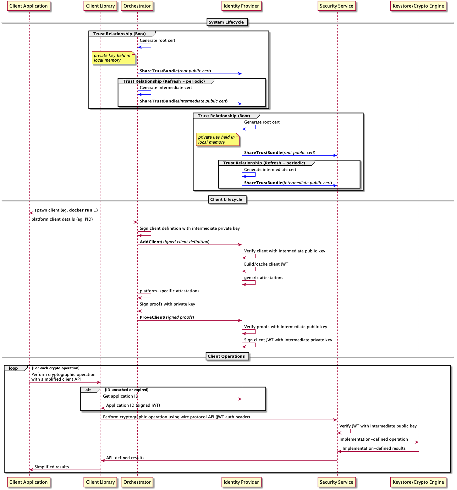

<!--
  -- Copyright (c) 2019, Arm Limited, All Rights Reserved
  -- SPDX-License-Identifier: Apache-2.0
  --
  -- Licensed under the Apache License, Version 2.0 (the "License"); you may
  -- not use this file except in compliance with the License.
  -- You may obtain a copy of the License at
  --
  -- http://www.apache.org/licenses/LICENSE-2.0
  --
  -- Unless required by applicable law or agreed to in writing, software
  -- distributed under the License is distributed on an "AS IS" BASIS, WITHOUT
  -- WARRANTIES OR CONDITIONS OF ANY KIND, either express or implied.
  -- See the License for the specific language governing permissions and
  -- limitations under the License.
--->
# **System Architecture**

## **Introduction**
This document sets out a system architecture for a deployment of the security service as part of a complete system where it can be used by client applications. This system architecture is constructed around an example deployment where the applications are running in containers within a shared operating system kernel (without full virtualisation). This is not the only possible deployment pattern, and many of the concepts in this document could be adapted to suit other deployments.

## **Status Note**
This is preliminary documentation. It may be incomplete, and is subject to change without notice.

## **Overview**
The security service provides an API to key storage and cryptographic operations. This API is based on the [**PSA Crypto API Specification**](https://github.com/ARMmbed/mbed-crypto/blob/psa-crypto-api/docs/PSA_Cryptography_API_Specification.pdf). The API is exposed to clients over a transport medium using a [**wire protocol**](wire_protocol.md), so that it can be consumed by client applications in multiple programming languages, residing in separate processes on the shared physical host. The security service is a **multi-tenant** service. It isolates and partitions the key store such that secure assets provisioned by one client application cannot be used by another. This isolation can only be achieved if every client application is able to present a unique and stable identity to the security service. This identity also has to be validated on the host system, so that client applications can prove their identity and therefore authenticate themselves to use the security service.

The distribution and validation of client identitites is a vital part of the overall deployment of the system. This system architecture sets out one possible way in which this can be achieved end-to-end.

The goal of this or any system architecture is to show how any client application can call an individual cryptographic operation, such that the security service can not only trust the source of the call, but also perform it with the required degree of isolation from other clients.

Isolation is based on the critical concept of an **application identity**. An application identity is a canonical string value, akin to a namespace, which is used to partition all storage (whether persistent or ephemeral) and all activities within the security service. Application identities are unique per client application. They are stable across application restarts, system restarts, and component upgrades.

The system architecture enables each client application to pass its application identity to the security service in a way that is cryptographically proven end-to-end. This allows the security service to trust the caller's identity, and to implement the required isolation. The architecture achieves this by placing the security service alongside some additional components that understand the client application lifecycle and are able to both provide and prove the identity string for each client.

The system architecture document is structured as follows:
* A set of **design goals** is established to act as guiding principles and constraints for the architecture.
* The **participating components** are listed along with a definition of their roles within the system. Note that the security service is the only component whose implementation is contained in this source code repository. Additional components are implemented separately. This document only sets out the required roles and contracts of those additional components. Their precise implementation can depend on the deployment.
* The **trust relationships** are described in terms of how they are established and maintained, and also in terms of which components share such relationships.
* The **trusted data payloads** are described. These are the data objects that are subject to cryptographic signing and verification according to the defined trust relationships.
* Finally, the **flows** of data between components are captured in a sequence diagram, which shows how the system is bootstrapped and then used on an ongoing basis.

## **Design Goals**
The system architecture aims to address the following design goals and constraints:

* The system should be **fault tolerant** in general, but specifically with respect to any transient loss or restart of any of the participating components. If one component restarts, then other components should be able to recover their ability to communicate with it, such that there is no loss of functionality across the system as a whole. It is acceptable for sub-optimal performance to be incurred for a transient period during recovery.
* Communication channels should be **stateless**. This is partly to address the fault-tolerance requirement set out above, but also because it is generally considered to be good practice in service-oriented architectures of which this system is an example. The participating components will necessarily have their own internal state where needed, both persistent and ephemeral. The security service, for example, has at least one store for secure assets (such as keys). But components should not rely on shared state without an ability to re-synchronize that state at arbitrary times.
* Communication channels should be **secretless**. Passing private keys or other secrets across wire protocol interfaces is forbidden. Only public keys or other non-confidential assets can be passed.
* Components should store any secret data **in local process memory only**, unless there is an overriding requirement for it to be stored persistently. Trust relationships between components need to be re-established (by sharing the public part of a new key pair) in the case where a component is restarted.
* The system should be **cryptographically secure**. A cryptographically-provable mechanism must exist in the communication channels between components.
* Cryptographic security should be established on a **short-lived** basis. Trust between components must be refreshed periodically.

## **Participating Components and their Roles**
The system architecture defines the following participating components, all of which are assumed to co-reside on the same physical host:

* The **client application** is the ultimate consumer of the security API. Any number of client applications can share the same physical host. They can be written in different programming languages, and reside across multiple containers or processes. The functionality of each client application is arbitrary, and the only thing that they have in common is their shared requirement to access the cryptographic services of the host platform. Client applications should not be confused with processes or containers. It is possible for a single client application to be spread across multiple processes or containers. Conversely, it is possible for a single process or container to house multiple client applications. The boundary between client applications is a security boundary that is defined and arbitrated by other components in the system.

* The **client library** is a convenience layer that provides a simplified and idiomatic way to access the security API in a specific programming language. The client library is loaded by the client application and shares its address space. Communications between the client application and the client library are in-process and in-language procedure calls with no IPC. There is one client library per supported programming language. Client libraries are more than just bindings. Each one offers a highly-designed developer experience tailored to the programming language, providing the API in a form that is simple to consume and hard to get wrong. This means that it has facilities for things like smart defaulting, so that the client application can call APIs with fewer arguments and simplified contracts that are tailored for specific use cases. The client library is then fundamentally an adaptor or wrapper: it converts between the simplified developer experience and the comprehensive API definition based on the PSA Crypto API. It makes calls to the security service according to the defined [**wire protocol specification**](wire_protocol.md).

* The **orchestrator** is the component that manages the lifecycle of the client applications on the physical host. It is responsible for starting and stopping their containers or processes. In a containerized environment on a Linux system, a daemon such as [**dockerd**](https://docs.docker.com/engine/reference/commandline/dockerd/) would naturally assume the role of the orchestrator in this system architecture. A single instance of the orchestrator runs on the host system.

* The **security service** is the component that provides the API to the cryptographic services of the host platform. This API is based on the [**PSA Crypto API Specification**](https://github.com/ARMmbed/mbed-crypto/blob/psa-crypto-api/docs/PSA_Cryptography_API_Specification.pdf). A single instance of this service runs on the host system (deployed, for example, as a daemon). It listens on a suitable host-local transport medium such as a Unix domain socket and exposes a [**wire protocol**](wire_protocol.md) with a [**defined API**](api_overview.md). The inner architecture of the service is described in the other documents in this repository.

* The **identity provider** is the component that assigns unique and stable application identities to each client application. Any string that can be used persistently and unambiguously to refer to one and only one client application is suitable. This system architecture proposes the use of a Uniform Resource Identifier (URI), such as the identity scheme used by [**SPIFFE**](https://spiffe.io). The identity provider receives application lifecycle events from the orchestrator, and these events contain enough information for the identity provider to deduce the application identity and return it to client applications on request. The identity provider is fundamentally a mapping service, with orchestrator data as its input and application identities as its output. The identity provider exposes the same [**wire protocol**](wire_protocol.md) as the security service, albeit with a different set of APIs to reflect its very different role.

* The **crypto provider** is a back-end software module within the security service that interfaces with the hardware or software facilities of the platform in order to implement key storage and cryptographic operations. Within the service itself, these modules are simply called "providers", but the term "crypto provider" is used here to avoid confusion with the identity provider component. Crypto providers provide access to hardware facilities such as Trusted Platform Modules (TPMs) or Hardware Security Modules (HSMs). Alternatively, they might interact with software components running in a Trusted Execution Environment (TEE), or secure enclave, if the host platform supports them. Their implementations would vary considerably depending on the platforms, and these details are largely irrelevant to the system architecture. They are included here largely for completeness, since they are the ultimate provider of the cryptographic services being consumed by the client applications.

## **Trust Relationships**
This section outlines the trust relationships that exist between components, how they are established, and how they are maintained over the component lifetimes. This section covers only those trust relationships that are material to the system architecture: other trust relationships might exist in the system for various reasons.

The trust relationships detailed below are always established between pairs of components: the **trusted component** and the **trusting component**. They are based on **asymmetric digital signatures**. They rely on trusted component being able to sign some data such that the trusting component can verify it.

* The trusted component generates a **root key-pair**.
* The trusted component maintains the **root private key** in process-local memory only. The private key is not shared with any other component, nor is it stored persistently.
* The trusted component sends the **root public key** to the trusting component as an X509 certificate. This is done by making an API call according to the conventions of the [**wire protocol specification**](wire_protocol.md). This is strictly a one-time operation, and this must be enforced by the trusting component. Any attempt to send revised root keys must be rejected. For more information, refer to the [**ShareTrustBundle**](operation_directory/trust/share_trust_bundle.md) operation in the API reference.
* On a periodic basis, the trusted component generates a new **intermediate key pair**, and once again keeps the private key in process-local memory only.
* On each periodic refresh, the trusted component sends a new **intermediate public key** to the trusting component, again as an X509 certificate. (This allows the trusting component to view the intermediate certificate and the root certificate as a chain).
* In general communication, the trusted component will use its private key to sign data, and the trusting component will use the public certificate chain to verify it. If verification passes, then the data can be trusted.

The term "root" here should be qualified, since any root key or certificate is only a root from the perspective of this system architecture. This does not exclude the possibility that these roots are themselves part of a longer trust chain involving an external Certificate Authority (CA). Integrations with external CAs are outside of the scope of this document. The term "root" should always be considered with this qualification in mind.

In this system architecture, two trust relationships exist, each of which is established and maintained according to the scheme described above. The trust relationships are as follows:

* Between the **orchestrator** and the **identity provider**. In this case, the orchestrator is the trusted component and the identity provider is the trusting component. The need for a trust relationship here is due to the orchestrator being a presenter of client definitions and proofs to the identity provider.
* Between the **identity provider** and the **security service**. In this case, the identity provider is the trusted component and the security service is the trusting component. The need for this trust relationship is to allow the identity provider to sign authentication tokens on behalf of each client, such that the security service can verify those tokens and permit an API call to proceed.

## **Wire Protocols**
Both the identity provider and the security service expose an API endpoint based on the common [**wire protocol specification**](wire_protocol.md). However, the roles of these two components are very different, and it follows that the set of API operations offered by each endpoint will be likewise different. In the case of the security service, the majority of its API operations are for key storage and cryptography, and are based on the PSA Crypto API. In the case of the identity provider, a much smaller set of operations are needed, and these enable the sharing of client definitions and proofs.

The only part of the API that is common between the two components is the [**ShareTrustBundle**](operation_directory/trust/share_trust_bundle.md) operation, which is used to establish and maintain trust relationships.

The identity provider additionally offers the [**AddClient**](operation_directory/identity/add_client.md) and [**ProveClient**](/operation_directory/identity/prove_client) operations, which allow the orchestrator to inform the identity provider about the lifecycle of client applications. This small operation set represents the entirety of the identity provider's API.

By contrast, the security service exposes the full capabilities of the PSA Crypto API.

## **Trusted Data Payloads**
A trusted data payload is any data payload that is signed and verified according to one of the defined trust relationships. Since two trust relationships are defined in this system architecture, it follows that a trusted data payload is either a payload that is signed by the orchestrator and verified by the identity provider, or it is a payload that is signed by the identity provider and verified by the security service. This section outlines the trusted data payloads that are subject to such sign-and-verify procedures.

### **Client Definitions**
The system architecture requires each client application to have an identity that is unique and stable. This requirement for stability is especially important given that many low-level characteristics of a client application may change over time. Process identifiers, for example, can change as a client application restarts. Even the contents of a client application image can change due to an upgrade. So a client application needs to be able to present enough pieces of information to the identity provider in order for the identify provider to make a binding decision about the identity.

These pieces of information are collected together into what is called a **client definition**.

There can be no fixed set of properties that would make an adequate client definition in any environment. The system architecture only requires that the orchestrator and the identity provider are able to agree on what the client definition should be. Client definition is essentially a contract between those two components. An example of a client definition might be a JSON document containing properties such as the container image identifier, host identifier and kernel namespace.

Client definition formats are agreed between the orchestrator and the identity provider on any given system. A JSON or similar structure would be typical. The client definition is constructed by the orchestrator, and notified to the identity provider at key lifecycle points such as client start-up or shut-down. (More details are given in the section on dataflows below).

Client definitions, regardless of their precise format and content, must be signed by the orchestrator and verified upon receipt by the identity provider. The orchestrator will use its own private key for signing, and verification will be via the shared public key. See the section above on trust relationships for details of how these keys are generated and shared.

### **Client Proofs**
A client definition is essentially a set of claims. By presenting a client definition, the client application is asserting its worthiness to be assigned a particular identity string by the identity provider. In order for these claims to be made valid inputs to the mapping process, the identity provider needs to be able to trust them. They cannot simply be asserted. They must also be **proved**. Proofs are obtained through an attestation process, the precise details of which are beyond the scope of this document, but illustrative examples might be:

* Supply-chain proofs, such as an image signature or signatures on component binaries.
* Host proofs, such as might be derived from a platform root-of-trust.
* Runtime proofs, such as process identifiers, user/group identifiers, kernel namespaces or application-specific key pairs.

As with client definitions, client proofs must be signed by the orchestrator and verified upon receipt by the identity provider. The orchestrator will use its own private key for signing, and verification will be via the shared public key. See the section above on trust relationships for details of how these keys are generated and shared.

### **Authentication Tokens**
When client applications invoke API operations in the security service, they must include their application identity string somehow. This allows the security service to provide the required level of isolation amongst the multiple clients that might exist. Not only must the identity string be specified, but it must be specified in a way that allows the security service to be sure that it is genuine. Client applications do this by means of an **authentication token**. 

The [**wire protocol specification**](wire_protocol.md) has an **authentication header** field that is suited to this purpose. The protocol is very flexible, and the authentication header can be used in a variety of ways. It would be entirely possible for the client application to simply pass its application identity directly as a cleartext string. The security service would support this (and it offers an authentication style known as **direct authentication** for this purpose). This is simple, and works well in a demo or proof-of-concept environment. But it is not suitable for a deployed system architecture, because it does not fulfil the stated design goal of secretless communication.

The solution to this problem is for the authentication header to contain a payload that not only includes the application identity, but also proves cryptographically that it is from a valid client. This payload takes the form of a [**signed JSON Web Token (JWT)**](https://tools.ietf.org/html/rfc7519).

The application identity string will be carried as one of the JWT claim fields. (TODO: which one?) Since the JWT will be signed, this allows the security service to verify that it is genuine, and thus permit the call to go ahead with the required level of isolation.

JWT tokens are not directly signed by client applications, since client applications do not participate in any of the trust relationships that this system architecture has defined. Instead, they are signed by the identity provider, and passed back to the client application in order to eventually be forwarded to (and verified by) the security service. The identity provider uses its private key to sign the JWT. The security service has the public part of this key, and is hence able to perform the verification. The identity provider and the security service share one of the trust relationships that were defined above.

## **Flows**

### **System Lifecycle: Boot**
The following bootstrapping actions are needed in order to establish the trust relationships that exist between the orchestrator and the identity provider, and between the identity provider and the security service respectively. For more details, see the section above on trust relationships. The bootstrapping flows require each component to generate a root key pair, to store the private key part in process-local memory, and to share the public part (as an X509 certificate) with the trusting component.

Public root certificates are shared using the [**ShareTrustBundle**](operation_directory/trust/share_trust_bundle.md) API operation, with a flag to indicate that this is a root certificate as opposed to an intermediate. Both the security service and the identity provider support this operation via the respective (separate) wire protocol endpoints.

Root certificates may be shared only once. The [**ShareTrustBundle**](operation_directory/trust/share_trust_bundle.md) operation is defined to fail if it is called more than once with the root flag set.

### **System Lifecycle: Refresh**
Background flows occur on a periodic cadence while the system is active, and they are aimed at maintaining the trust relationships between the orchestrator, identity provider and security service.

Trust relationships require intermediate key pairs to be generated periodically in order to fulfil the stated design objective around short-lived cryptography. The root key pairs generated in the bootstrapping phase do not fulfil this objective by themselves.

Intermediate key pairs are generated by both the orchestrator and identity provider. Each component stores its private key in local process memory, but needs to share the public key. As with the bootstrapping flows, the orchestrator shares its public key with the identity provider, and the identity provider shares its public key with the security service. There is a common API in the wire protocol to support this operation.

Public intermediate certificates are shared using the [**ShareTrustBundle**](operation_directory/trust/share_trust_bundle.md) API operation, with a flag to indicate that this is an intermediate certificate as opposed to a root. Both the security service and the identity provider support this operation via the respective (separate) wire protocol endpoints.

Intermediate public certificates may be shared any number of times. Any previous intermediate certificate is immediately invalidated upon the event of a new intermediate being shared.

### **Application Lifecycle**
Client application lifecycles are governed by the orchestrator. The orchestrator is responsible for starting and stopping the client application containers or processes. It is also responsible for notifying these events to the identity provider, and for sending the client definitions and client proofs.

To add a new client definition to the identity provider, the orchestrator calls the [**AddClient**](operation_directory/identity/add_client.md) operation with a signed data payload containing the client definition properties (typically a JSON document).

Having informed the identity provider of a new client definition, the next role of the orchestrator is to run an attestation process to prove its validity. The results of the attestation process are then sent to the identity provider using the [**ProveClient**](operation_directory/identity/prove_client.md) operation, again with a signed data payload containing the proofs.

### **General Usage Flows**
The final flow to consider is the general use case of the client application making a call to the security service to perform a cryptographic operation with isolation. This is obviously the most commonly-occurring flow, and everything else in the system is geared towards enabling this fundamental operation.

This flow begins with the client application, which consumes the security API via the client library. Recall that client libraries exist for a variety of popular programming languages. Recall also that each client library offers a highly-designed developer experience, with appropriate levels of simplification and argument defaulting so that common cryptographic use cases are catered for with a minimum of effort on the part of the application developer.

The client library is responsible for implementing the language-specific idioms in terms of one or more wire protocol API calls to the security service. In order to make these calls, it needs a signed JWT token that embeds the correct application identity for the client. These tokens come from the identity provider. Hence the client library must first call the identity provider to obtain this token. It can then call the security service with the signed token.

The security service is responsible for verifying the token and extracting the application identity from it. This identity can then be used as a namespace for all secure assets that are stored for that client.

Once the security service has verified and accepted a call to an API operation, it becomes the responsibility of the back-end cryptographic provider to actually implement the call either in software or hardware. Once the operation has been executed, the results can be marshalled back to the client library, which can once again implement whatever simplifications or interpretations are required to make them suitable for the application developer.

### **Sequence Diagram**
All flows are summarised and captured in the sequence diagram below. The diagram attempts to collect together and summarise all of the flows that are needed for bootstrapping, background operations and also general usage as described above. In order to strike the right balance between completeness and simplicity, the flow diagram does not include every possible path. In particular, the actions taken in response to errors or failed verifications are not captured here.

.