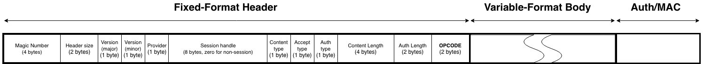
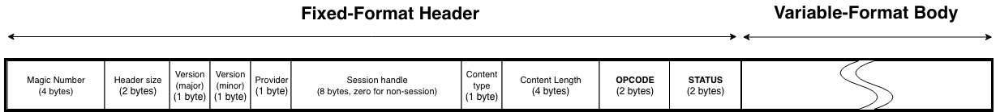

<!--
  -- Copyright (c) 2019, Arm Limited, All Rights Reserved
  -- SPDX-License-Identifier: Apache-2.0
  --
  -- Licensed under the Apache License, Version 2.0 (the "License"); you may
  -- not use this file except in compliance with the License.
  -- You may obtain a copy of the License at
  --
  -- http://www.apache.org/licenses/LICENSE-2.0
  --
  -- Unless required by applicable law or agreed to in writing, software
  -- distributed under the License is distributed on an "AS IS" BASIS, WITHOUT
  -- WARRANTIES OR CONDITIONS OF ANY KIND, either express or implied.
  -- See the License for the specific language governing permissions and
  -- limitations under the License.
--->
# **Wire Protocol**

## **Introduction**
This document describes and specifies the wire protocol that exists between the service and its clients. It explains the general principles of how the protocol is structured, and goes on to provide a full specification that can be used as the basis of both client-side and service-side code.

## **Status Note**
This is preliminary documentation. It may be incomplete, and is subject to change without notice.

## **Scope**
This document describes the principles, patterns and low-level details of the wire protocol. This covers the details that are common to all messages that pass between the service and its clients. This document is *not* an API specification for the service. Individual API operations, along with their behaviours, inputs and outputs are described separately in the API specification. The wire protocol is the underlying message-passing mechanism that enables the API.

## **Audience**
A thorough understanding of the wire protocol is necessary if you are developing new capabilities within certain parts of the service, or if you are developing or extending one of its client libraries. However, it is not necessary to understand the wire protocol in order to consume the client API into an application.

## **General Principles**

### **Binary Protocol**
The wire protocol is a [**binary**](https://en.wikipedia.org/wiki/Binary_protocol) and **stream-oriented** protocol. It is designed for speed and compactness of transmission.

### **Requests and Responses**
The wire protocol is principally structured around the notion of a **request** and a **response**. Requests and responses are self-contained pairs of entities, where each request is answered by exactly one response. Requests always travel from the client to the service, and responses always travel back from the service to the client. Each pair of request and response encapsulates a single call to a single operation provided by the service. Client library code is concerned with forming requests and transmitting them to the service. Service code is concerned with processing requests, forming responses, and transmitting those responses back to the client. The term **message** is used to refer generically to requests and responses in contexts where there is no need to draw a distinction between them.

### **Analogy With HTTP and REST**
The request-response pattern of the wire protocol is intentionally modelled on the familiar notion of calling a REST API over HTTP. In fact, one of the guiding principles of the wire protocol design has been to create something that might loosely be called a "lightweight REST". This term must be applied with caution, however. REST is a collection of architectural principles, not a protocol. It does not follow that all of the RESTful principles are adopted here. However, thinking of the wire protocol as being like a web service protocol, only without any dependency on HTTP or similar stacks, can be a good way to gain an initial understanding. Some patterns of the wire protocol design have their foundation in a mixture of concepts taken from HTTP and REST, but the wire protocol itself is neither of these things: it is an entirely bespoke protocol.

### **Synchronous Operation**
The wire protocol operation is synchronous: the client initiates a connection and transmits a request. It then blocks while the service performs the request and transmits the response on the return stream. The protocol therefore only supports short-lived operations (meaning that the fulfillment time must be well within any timeout limitations that the transport might impose). The protocol can support longer-lived operations, but it is the responsibility of the service API to define how these are managed. There could, for example, be a pattern whereby there are separate initiation and status polling operations.

### **Separation of Protocol and Transport**
The wire protocol defines the format of messages, and some key characteristics and invariants concerning their transmission between the service and its clients. It does not mandate a specific transport stack. The wire protocol is a binary, stream-oriented protocol. As such, it can be carried by any transport medium that supports the reliable transmission of binary octet streams, such as Unix domain sockets (connected in streaming mode) or TCP sockets. Datagram-oriented transports are **not** supported, because the protocol depends on the reliable transmission of entire messages in the proper sequence.

### **Separation of Header and Body**
Every message (whether request or response) has a **header** and a **body**. Again, this is conceptually similar to the separation of header and body in HTTP. And, like HTTP, this protocol allows some flexibility in how the body content is encoded. The wire protocol borrows HTTP's notion of the **content-type** and **accept** header fields, which allow the client to tell the server how to interpret the content, and also to declare what kind of response is acceptable in return. The only difference is that the wire protocol uses numerical byte fields to indicate these values, where HTTP uses string key-value pairs and media types. This is another illustration of how the wire protocol can be viewed as a more compact and stripped-down HTTP.

The message headers are **fixed-length** and **fixed-format**. The headers themselves have no variability in their encoding, nor do they adhere to any encoding or serialization standard. The format of the header is defined solely by this specification. When writing code to either transmit or receive a header, the code must be written and validated according to this specification alone. Headers are composed of a series of single-byte and multi-byte fields. The request headers and the response headers differ somewhat from each other. A full specification of the byte fields for both request headers and response headers will be found later on in this document.

Headers carry a fixed set of metadata fields that are common to all messages. However, they do not carry any inputs to or outputs from specific API operations. API inputs and outputs are always carried in the body. Unlike the header, the body can be both variable-length and variable-format.

### **Protobuf Body**
As described above, the wire protocol design allows for the message body to be structured and encoded in a variety of formats. However, in current manifestations of the protocol, only a single encoding is defined for use in the message bodies, and this encoding is based on [**protocol buffers**](https://developers.google.com/protocol-buffers/), also known as **protobuf**.

For each operation in the API, two separate protobuf message definitions will exist: one for that operation's inputs, and another for its outputs. The content bytes in a request message can be converted through protobuf-generated code into a model object for the inputs. Likewise, the content bytes in a response message can be converted through protobuf-generated code into a model object for the outputs.

Processing any message is, therefore, a two-phase process: firstly, the header must be processed by writing code that is conformant with this specification; and secondly, the content must be processed according to its content type, which is currently always protobuf.

Future manifestations of the wire protocol might support encoding schemes other than protobuf, in which case the second phase of processing would differ. This is the reason why the protocol design has granted some flexibility in terms of the message body encoding.

It is worth re-iterating that protobuf encodings are employed only for *message bodies* and not for headers. As explained above, headers employ a bespoke binary encoding that is fully defined within this specification alone. There is no use of protobuf within the header. Headers can be parsed and generated only by writing code that conforms to this specification document. Again, this permits for the possibility that a future manifesation might support different encoding schemes.

### **Authentication**
As described above, all messages in this protocol have a header and a body. If a message is a request (as opposed to a response), then it will additionally carry a third component: its **authentication** field. 

The wire protocol is agnostic about how the authentication field is interpreted. The request header measures the size of the field so that the service can consume the correct number of bytes from the input stream. The request header also includes a one-byte integer label to inform the service how to interpret the authentication bytes.

Authentication is based on the invariant that all client applications have access to a persistent unique identifier. This is a string token that allows the assets and actions of one client to be cleanly separated from those of another. But while this identifier string is the core component of authentication, there are different ways that it can be used, and consequently there are different ways for the authentication field to be populated. One simple method is for the client identifier to be passed directly. But it is also possible to use the identifier as input to an HMAC algorithm over the content bytes, in which case the authentication field would contain the computed HMAC, rather than the identifier itself.

### **Sessions**
The wire protocol supports the notion of sessions, which can be used to allow the client and the service to track state across multiple API calls. The protocol allocates space within the request header and the response header for an 8-byte session identifier. Details of how to create and manage sessions are given in the API specification.

### **Versioning**
The wire protocol is versioned. It caters for situations where the service and its clients may be operating at different versions. All messages (requests and responses) carry a major and minor version number field. All versions of the service must respond to at least one API operation using version 1.0 of the protocol. This API operation would typically be some kind of "ping" or "status" operation. The output of this operation will allow the client to determine the highest version of the protocol that the service supports, so that it can upgrade to this version if desired.

### **Opcodes**
All requests contain an unsigned 2-byte integer field called the **opcode**. The opcode is the value that determines which API operation is being invoked by the requests. Recall that each request/response pair corresponds to the invocation of exactly one API operation, and each of these operations is assigned an integer opcode.

The opcode zero is not used and is not valid. The lowest valid opcode is 1, and the highest valid opcode is 65,535. Within this overall numerical range, certain partitions and conventions are established. Ranges of opcodes must be carefully observed and not abused. Contributing developers will have the opportunity to claim parts of the numerical range for their own unique features and operations.

Currently, opcodes 1-999 are reserved for internal service housekeeping operations, and opcodes 1000-1999 are reserved for key management and cryptographic operations corresponding to those of the Platform Security Architecture (PSA) Cryptography API.

Opcodes from 2000 onwards are currently unused and unreserved. No service or client code may be contributed that uses such opcodes. Please see the contribution guidelines for further information.

All opcodes are defined within the API specification.

### **Status**
All responses contain an unsigned 2-byte integer field called the **status**, which is defined to indicate the overall success or failure of the operation.

The status value of zero is used universally to mean that the operation completed successfully.

With the exception of zero as a special case, other status values are partitioned according to the same strategy as the opcodes. Status values from 1-999 are reserved for internal service housekeeping operations, and status values from 1000-1999 are reserved for status codes corresponding to the Platform Security Architecture (PSA) Cryptography API.

All status values are defined within the API specification.

## **Message Structure Specifications**

### **General Rules**
This section provides a complete specification for the interpretation of messages. Based on this specification, service and client code can be created to both consume and produce conformant messages on any suitable transport medium.

All multi-byte numerical fields are transported in **little-endian** format.

### **Requests**
Requests are structured in the wire protocol as follows:

Field descriptions:

* Magic number: a 32-bit unsigned integer whose value must be 0x5EC0A710 (selected to be an approximate transcoding of SECurity API). This field can be used as an initial validity check for incoming messages. This field **must** be populated in outgoing messages.
* Header size: a 16-bit unsigned integer whose value is the size of the **remainder** of the header in bytes (once the magic number and header size fields have been consumed). Consumers **must** use this field to consume the correct number of bytes of header from the input stream, rather than use this specification to deduce the header size.
* Major version number: an 8-bit versioning field. Currently the only supported and valid value for this field is 1.
* Minor version number: an 8-bit versioning sub-field. Currently the only supported and valid value for this field is 0.
* Provider: an 8-bit field identifying the back-end service provider for which the request is intended. A value of zero indicates that the request is not intended for any specific provider. Available providers and their characteristics can be queried through discovery operations in the API.
* Session handle: an 8-byte session identifier.
* Content type: an 8-bit field that defines how the request body should be processed. The only currently-supported value is 1, which indicates that the request body should be treated as a serialized protobuf message.
* Accept type: an 8-bit field that defines how the service should provide its response. The only currently-supported value is 1, which indicates that the service should provide a response whose body is a serialized protobuf message.
* Auth type: an 8-bit field that defines how the authentication bytes should be interpreted.
* Content length: a 32-bit unsigned integer field providing the exact number of bytes of content.
* Auth length: a 16-bit unsigned integer field providing the exact number of bytes of authentication.
* OPCODE: the 16-bit unsigned integer opcode, indicating the operation being performed by this request. See the section above on opcodes.

The request body bytes **must** immediately follow the request header bytes.

The authentication bytes **must** immediately follow the request body bytes.

### **Responses**
Responses are structured in the wire protocol as follows, and have many properties in common with requests:

Field descriptions:

* Magic number: a 32-bit unsigned integer whose value must be 0x5EC0A710 (selected to be an approximate transcoding of SECurity API). This field can be used as an initial validity check for incoming messages. This field **must** be populated in outgoing messages.
* Header size: a 16-bit unsigned integer whose value is the size of the **remainder** of the header in bytes (once the magic number and header size fields have been consumed). Consumers **must** use this field to consume the correct number of bytes of header from the input stream, rather than use this specification to deduce the header size.
* Major version number: an 8-bit versioning field. Currently the only supported and valid value for this field is 1.
* Minor version number: an 8-bit versioning sub-field. Currently the only supported and valid value for this field is 0.
* Provider: an 8-bit field identifying the back-end service provider for which the request is intended. A value of zero indicates that the request is not intended for any specific provider. Available providers and their characteristics can be queried through discovery operations in the API.
* Session handle: an 8-byte session identifier.
* Content type: an 8-bit field that defines how the response body should be processed. The only currently-supported value is 1, which indicates that the request body should be treated as a serialized protobuf message. In the future, alternative values might be supported, in which case the requirement is that the content type of the response **must** match the specified accept type of the corresponding request.
* Content length: a 32-bit unsigned integer field providing the exact number of bytes of content.
* OPCODE: the 16-bit unsigned integer opcode, indicating the operation that was performed. This **must** match the OPCODE field from the corresponding request, and can be used as a validation check within the client.
* STATUS: the 16-bit unsigned integer status, indicating the overall success or failure of the operation. A value of zero is used universally to mean success. Other values should be interpreted according to the API specification.

The request body bytes **must** immediately follow the request header bytes.